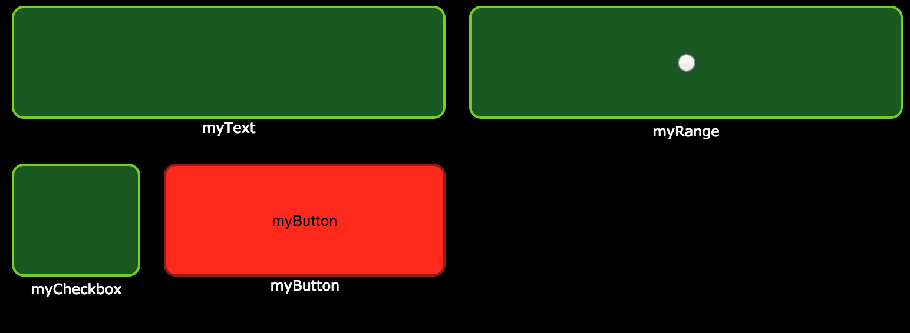

# osc-websocket



## The problem
The present OSC protocol isn't very web-friendly. Some applications like [TouchOSC](http://hexler.net/software/touchosc) allows user to remote control some parameters with soundconsole-like interface.

## What we're trying to do
We want to make a clone of the TouchOSC application with web technologies.

## Schema

```

(1)       Web application 
                | 
               JSON
                |
                v
(2)        Node.js Server
           |     |     |
          OSC   UDP   JSON
           |     |     |
           v     v     v
(3)      Final application

```

## Technologies

### Front end (1)
- Angular
- jQuery UI ?
- Raphael ?

### Back-end (2)
- Node.js
- Express Framework for serving static files
- [node-osc](https://github.com/TheAlphaNerd/node-osc) module
- [socket.io](https://github.com/Automattic/socket.io) module communication between back (2) and front end (1)


## Usage
- You can use the command ```cp config-sample.json config.json``` and edit ```config.json``` as you need to use custom settings. The web application (1) schema is in this file. If you run this command, ```config-sample.json``` will be used as a fall-back.
- Run ```npm install``` to install the packages  
- Run ```bower install``` to install bower components
- Run ```gulp build``` to build
- Run ```npm start``` to start the server

## Examples
Check the ```examples/``` folder for example recievers


## TODO
- More controls. Maybe one [like this](http://hexler.net/gfx/_software/touchosc-08.png) ?
- Adde the knob module !
- Accelerometer infos !
- Boussole infos !
- Improve the colors. Seriously, this is not good looking.

## Contributing
See [CONTRIBUTING.md](CONTRIBUTING.md)

## License
This project is under the MIT license. See the [LICENSE file](LICENSE) for details.
